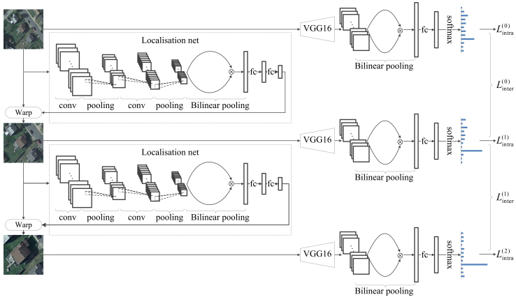

# RTN

This is a re-implementation of the paper-"Recurrent Transformer Networks for Remote Sensing Scene Categorisation". The framework as follows:

## Dependencies

- Python == 3.6
- Tensorflow == 1.10.0

## Data Preparation
### Download Datasets
The experimental datasets can be downloaded from:

  -[AID:A Benchmark Dataset for Performance Evaluation of Aerial Scene Classification](https://captain-whu.github.io/AID/),
  
  -[UC Merced Land Use Dataset](http://weegee.vision.ucmerced.edu/datasets/landuse.html), 
  
  -[NWPU-RESISC45](https://onedrive.live.com/?authkey=%21AHHNaHIlzp%5FIXjs&cid=5C5E061130630A68&id=5C5E061130630A68%21107&parId=5C5E061130630A68%21112&action=locate). 
  
  Please cite their original papers if you are going to use these datasets.

### Data Preprocessing
The downloaded datasets need to be placed in the corresponding directories in `../datasets/` and unzipped. Then, using `create_tfrecord.py` under the utils folder to split and process the data. An example of processing AID has been given in the script. Please note that the validation_size is set to 0.5001 since `railwaystation_7.jpg` fails to be encoded from my side.

### Pretrained Model
Please download the checkpoint of pretrained VGG 16 from [tensorflow.slim](https://github.com/tensorflow/models/tree/master/research/slim) and place it to the `net` folder. Next, creating three-scale weights by using `net_weights_create.py` in `utils`. 

### Training and Test
Example training and testing codes can be found in `exp/AID`. For simplicity, only the case where the data is split into 20% (training) and 80% (test) on the AID dataset is shown. The rest of the experiments are expected to be similar.

### Results
The reproduction results (20%-80%) of randomly splitting the dataset twice on AID can reach 93.06% and 92.86%. 

## Acknowledgements

This repo is based on
  - [STN](https://github.com/kevinzakka/spatial-transformer-network)
  - [BCCN](https://github.com/YuqiHUO/bcnn)

Thanks for the works of the original authors!

# Citation
If you find the work useful, please kindly cite the [paper](http://bmvc2018.org/contents/papers/0987.pdf):

    @inproceedings{chen2018recurrent,
                Author = {Chen, Zan and Wang, Shidong and Hou, Xingsong and Shao, Ling},
                Title = {Recurrent Transformer Networks for Remote Sensing Scene Categorisation},
                Booktitle = {in BMVC},
                Page = {266},
                Year = {2018}
              }
  
