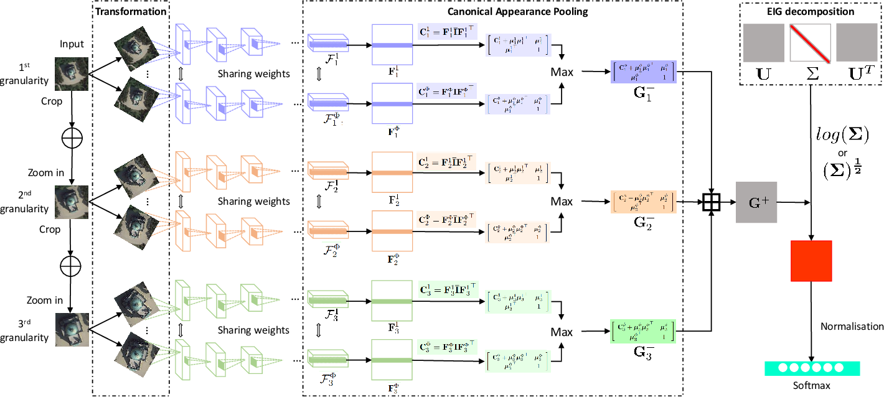
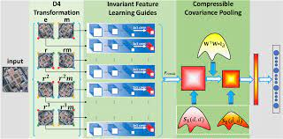

# RTN, MG-CAP and IDCCP

The repository exhibits the re-implementation of main scripts of three papers, the core of which is to summarise the second-order statistical data of local CNN features to gradually improve the performance of classifying remote sensing scene images. The frameworks included in the repository are shown as below:

"Recurrent Transformer Networks for Remote Sensing Scene Categorisation"-[PDF](http://www.bmva.org/bmvc/2018/contents/papers/0987.pdf):

"Multi-Granularity Canonical Appearance Pooling for Remote Sensing Scene Classification"-[PDF](https://arxiv.org/pdf/2004.04491.pdf):

"Invariant Deep Compressible Covariance Pooling for Aerial Scene Categorization"-[PDF](https://arxiv.org/pdf/2011.05702.pdf):

## Dependencies

- Python == 3.6
- Tensorflow == 1.10.0

## Data Preparation
### Download Datasets
The experimental datasets can be downloaded from:

  -[AID:A Benchmark Dataset for Performance Evaluation of Aerial Scene Classification](https://captain-whu.github.io/AID/),
  
  -[UC Merced Land Use Dataset](http://weegee.vision.ucmerced.edu/datasets/landuse.html), 
  
  -[NWPU-RESISC45](https://onedrive.live.com/?authkey=%21AHHNaHIlzp%5FIXjs&cid=5C5E061130630A68&id=5C5E061130630A68%21107&parId=5C5E061130630A68%21112&action=locate),
  
  -[OPTIMAL-31](https://drive.google.com/file/d/1Fk9a0DW8UyyQsR8dP2Qdakmr69NVBhq9/view).
  
  Please cite their original papers if you are going to use these datasets.

### Data Preprocessing
The downloaded datasets need to be placed in the corresponding directories in `../datasets/` and unzipped. Then, using `create_tfrecord.py` under the utils folder to split and process the data. An example of processing AID has been given in the script. Please note that the validation_size is set to 0.5001 since `railwaystation_7.jpg` fails to be encoded from my side.

### Pretrained Model
Please download the checkpoints of pretrained VGG 16 and ResNet V1 50 from [tensorflow.slim](https://github.com/tensorflow/models/tree/master/research/slim) and place it to the `net` folder. Then, you need to generate three different scale network weights based on VGG16 (named them as `vgg_16_1`, `vgg_16_2` and `vgg_16_3` in example scripts), or call it three times during training.

### Training and Test
Example training and testing codes can be found in `models/`. For RTN, only the case where the data is split into 20% (training) and 80% (test) on the AID dataset is shown. The rest of the experiments are expected to be similar. Before training MG-CAP model, please locate the `linalg_grad.py` file in TensorFlow and replace the `_SelfAdjointEigV2Grad` function with the code in `utils/linalg_grad.txt` to avoid NaNs when the gradient of the degenerated covariance matrix is solved during backpropogation.

## Acknowledgements

Some related repos include：
  - [STN](https://github.com/kevinzakka/spatial-transformer-network)
  - [Bilinear CNNs](https://github.com/YuqiHUO/bcnn)
  - [CovPoolFER](https://github.com/d-acharya/CovPoolFER)
  
Thanks for the works of the original authors!

# Citation
If you find the work useful, please kindly cite the following papers:

    @inproceedings{chen2018recurrent,
                Author = {Chen, Zan and Wang, Shidong and Hou, Xingsong and Shao, Ling},
                Title = {Recurrent Transformer Networks for Remote Sensing Scene Categorisation},
                Booktitle = {in BMVC},
                Page = {266},
                Year = {2018}
              }
    @article{wang2020multi,
            title={Multi-granularity canonical appearance pooling for remote sensing scene classification},
            author={Wang, Shidong and Guan, Yu and Shao, Ling},
            journal={IEEE Transactions on Image Processing},
            volume={29},
            pages={5396--5407},
            year={2020},
            publisher={IEEE}
          }
     @article{wang2020invariant,
            title={Invariant Deep Compressible Covariance Pooling for Aerial Scene Categorization},
            author={Wang, Shidong and Ren, Yi and Parr, Gerard and Guan, Yu and Shao, Ling},
            journal={IEEE Transactions on Geoscience and Remote Sensing},
            year={2020},
            publisher={IEEE}
          }
  
